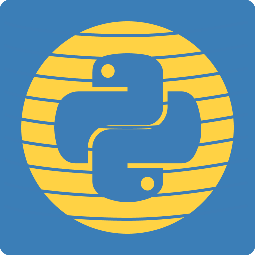

<div align="center">
    
    <h1>Pyder [ ALPHA ]</h1>
    Ever wanted Tauri or Wails but wanted Python's backend? Well, fear no more on finding them!
</div>

<br/>
Pyder is a project meant for an alterantive to Wails and Tauri for Python developers who wants to make a webapp with a Framework (Svelte, React, Vue, etc...) and a Python backend.

> psst, the joke in the project name is pyweb but the Web reference as a spider web and now it's called Pyder.

## How does this work?
Pyder uses three things. `PyWebView`, `NodeJS`, and `Vite`. `PyWebView` to show as a window and run a server, `NodeJS` to handle every web component, `Vite` to build the web app.

When initialized, `PyWebView`, and `Vite` will be pre-installed with your preferred package manager.

## How do I install `X` package in Python/Node PM?
**To install `X` package in Python, all you need to do is:**
- Be in a virtual environment (`source venv/bin/activate`, or `venv\Scripts\Activate`)
- And just use pip to install whatever package you want. For example, requests! Just do `pip install requests`.

**To install `X` package in Node PM, all you need to do is:**
- Install it with your preferred NodeJS package manager. Just do something like `pnpm add marked` or `npm install marked`.

Make sure when installing `X` package in Python, or Node PM, you're in your project root.

## How is this project being funded?
Nothing-burger. 0$ Funded. Free and Open source, fuck paying. Although, if you want to support the project, you can give us anything, really.

Starring, contributing, finding bugs to the project is already enough. Your suppport matters and we love it.

## Where's the documentation?
It's at [the wiki](https://github.com/PinpointTools/Pyder/wiki)! You can find on how to use Pyder with this.

## Where to download it?
**Per-commit releases**:
- Windows: https://nightly.link/PinpointTools/Pyder/workflows/main/main/Pyder-Windows.zip
- Linux: https://nightly.link/PinpointTools/Pyder/workflows/main/main/Pyder-Linux.zip
- macOS: https://nightly.link/PinpointTools/Pyder/workflows/main/main/Pyder-macOS.zip

**GitHub releases**:
- Releases: https://github.com/PinpointTools/Pyder/releases/
- Latest: https://github.com/PinpointTools/Pyder/releases/latest

# Known Issues:
- Unstable. Still in ALPHA.
  - Possibly already stable enough. Might be in Beta. rebuild your Vite app and the PyWebView page will reload.
- `package.json` containing everything like Project and such.
  - We're planning on something like this, but `pyder-project.json` instead.
  - It'll contain something like
```json
{
  "projectName": "pyder-project",
  "domainSystem": "io.github.pinpointtools",
}
```
